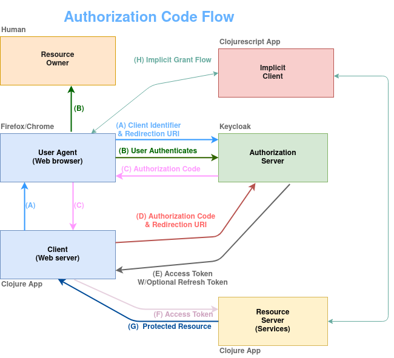

# OAuth 2.0 with Keycloak and Clojure



The purpose of this project is to showcase the use of Keycloak as an authorization server. We will be using Clojure for building the authorization client and other protected resources.
As time goes on, other features will be added and documented. The possible features can be seen in the listing below:

* Protecting resources with JWT tokens and added security with PKCE
* Redis for caching
* UI with Clojurescript (Hiccup, Reagent & maybe Re-frame as well ;))
* CI/CD (not sure about the technologies yet...)
* Tests

## Keycloak

Keycloak is used as our authorization server.

The following command will get our dockerized keycloak up and running:
```
$ docker-compose -f keycloak-postgres.yml up
```
Keycloak will be available at this address: `http://localhost:8080/auth`
Log in with these credentials: `admin / admin`
You will need to create a new realm for testing purposes. Once the realm is created, add a client to it.

Use the following configuration for your client:
* Client protocol -> `openid-connect`
* Access type -> `confidential`
* Root URL -> `http://localhost:3000`

To list the Keycloak endpoints in use in our authorization client, load your test realm page and click on the endpoints link. You should get a similar listing as in the pic below:


Lastly add a new user for login purposes.

## Authorization Client (Clojure)
The Clojure projects are managed with the Clojure CLI tool. The `deps.edn` file holds the configuration and the needed dependencies.
Cd into the `clj-auth-service` directory and execute this command:
```
$ clj -M -m core.sso-clojure
```
Our authorization service will be running at port `3000`.

## License

* [Apache License, Version 2.0](https://www.apache.org/licenses/LICENSE-2.0)
